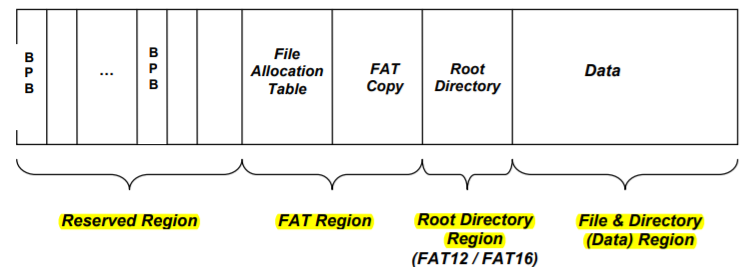
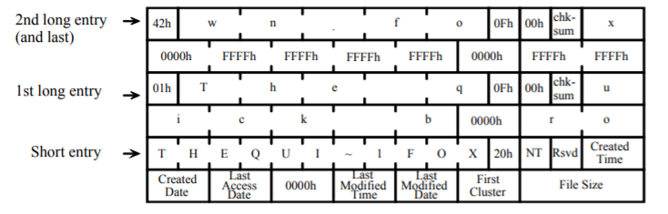

# fat32

FAT32 将一个卷分为三个区域

- Reserved Region
- The File Allocation Table(FAT)
- The directory and  data area
- 

### Boot Sector and BPB

Boot Record 占用每个卷保留区域( Reserved Region)的**0号扇区** 或者叫boot sector

位于boot 扇区的 BPB 必须包含所有的BPB区域位置,以确认FAT卷能够支持的最大容量

> The BPB in the boot sector of a FAT volume must always have all of the BPB fields for either the FAT12/FAT16 or FAT32 BPB type. This ensures maximum compatibility of the FAT volume and will also ensure that all FAT file system drivers understand and support the volume correctly. 

为了保证数据不会丢失,在sector 6 必须放置一个备份的BPB

#### BPB and BS

| offset(decl) | offset(hex) | size(bytes) | meaning                                                      |
| ------------ | ----------- | ----------- | ------------------------------------------------------------ |
| 0            | 0x00        | 3           | jump over the bpb and ebp                                    |
| 3            | 0x03        | 8           | OEM identifier                                               |
| 11           | 0x0b        | 2           | the number of bytes per cluster                              |
| 13           | 0x0d        | 1           | number of sectors per cluster                                |
| 14           | 0x0e        | 2           | number of reserved sectors. the boot record include          |
| 16           | 0x10        | 1           | number of fat on the storage media.ofen 2                    |
| 17           | 0x11        | 2           | number of directory entries (must be set so that the root directory occupies entire sectors). |
| 19           | 0x13        | 2           | the total sectors in the logical volume.if value is 0,more than 65535 sectors in volume .actual count stoted in Large Sector Count entry  at **0x20** |
| 24           | 0x18        | 2           | number of sectors per track                                  |
| 26           | 0x1a        | 2           | number of heads or sides on the storage media                |
| 28           | 0x1c        | 4           | numbers of hidden sectors                                    |
| 32           | 0x20        | 4           | large sector count this field                                |

#### Extended Boot Record

| offset(decl) | offset(hex) | size(bytes) | meaning |
| ------------ | ----------- | ----------- | ------- |
| 36           | 0x24        | 1           |         |

| sector id | 内容                            |
| --------- | ------------------------------- |
| 0         | BS(boot sector) 包含BPB         |
| 1         | FSinfo 包含FAT32 卷一些基本信息 |
| 6         | BS bak                          |
| 7         | FSInfo bak                      |
|           |                                 |

## short entry

8.3 format

- 8个字节的基本名
- 3个字节扩展名
- 文件名在存储时转换为大写
- 允许没有基本名
- 不能使用特殊字符 包括(0x22,0x2a,0x2b,0x2c,0x2e,0x2f,0x3a,0x3b,0x3c,0x3d,0x3e,0x3f,0x5b,0x5c,0x5d,0x7c)

tips

> 1. 使用0x20填充尾随空间
> 2. dir_name[0] 0xe5表示 该direntry 可用
> 3. 0x00同样表示 dirent 可用 ,同时也表示尾随的direntry 全部可用
> 4. dir_name[0] 不能 等于 0x20 (以空格开头)

每个目录项都必须有两个目录 `.` `..`,指向父目录和本身(除了根目录)

空文件目录项中的first cluster 字段为0

## long entry

- 长目录项是通过一系列额外的目录项实现的

- long dir entry 必须置于短文件目录项之前,并与之相邻

- 最后一个long entry order = order | 0x40

对长名称对应的短名称计算校验和,并置于每个长名称目录下

# 文件缓存

