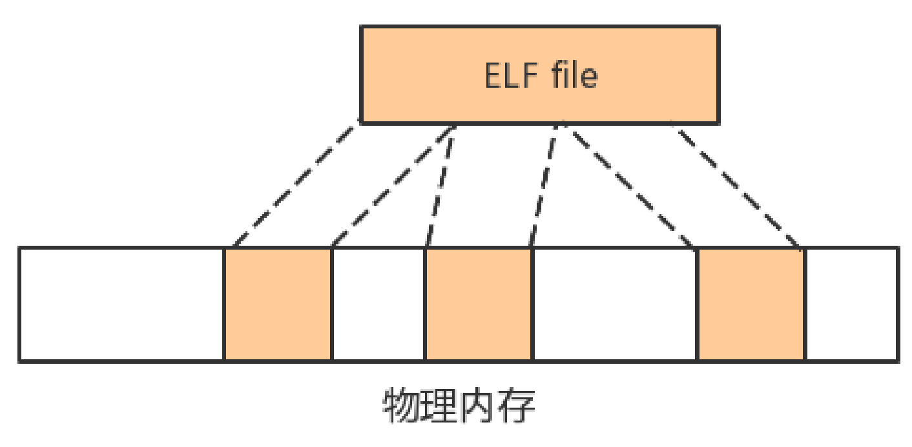
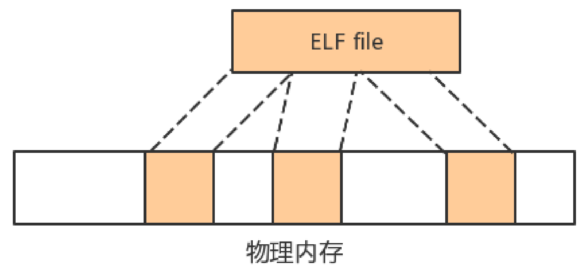
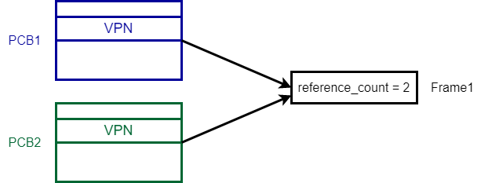
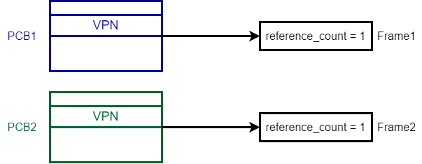

# 优化

## 内存

#### 懒分配的堆/栈/mmap
在比赛之初，为了方便实现，采用静态预分配的方式为每一个用户程序保留固定大小的堆/栈空间，但这会带来两方面问题：
1. 大多数程序对堆/栈/mmap的需求较小，造成内存资源浪费
2. 小部分程序对堆/栈/mmap的需求很高，导致程序无法正常运行
因此就需要一种能动态分配堆/栈空间的方式，基本策略是：只有进程初次使用虚拟页（即引发StorePageFault/LoadPageFault）时，才为其分配和映射内存，即懒分配策略。这种动态分配策略虽然能有效避免内存浪费，但可能带来另外一个问题：引发trap再分配内存会降低程序执行效率。
解决的方式是结合静态和动态分配策略，给每个进程提前分配少量堆/栈/mmap空间，满足大部分对堆/栈/mmap需求小的进程，避免这些进程引发懒分配；对于少部分需要大量使用堆/栈/mmap的进程，引发trap后再分配内存。

#### kmmap
起初exec操作是将ELF文件读入到内核堆中，再解析生成地址空间。内核堆采用伙伴管理系统，需要极大的额外空间以支持大型可执行文件，例如busybox大小为1M，但实际在内核堆中需要2M左右空间。但在实际运行中，并不需要如此大的内核堆，需要将尽可能多的内存留给用户程序。
为此我们参考上一届UtralOS的思路，实现了kmmap，即为内核服务的mmap，将文件映射到内存，同时通过非恒等映射为内核提供连续的虚拟地址。

根据文件大小分配内存，同时在内核页表建立与连续虚拟地址 的映射：

将可执行文件载入映射区域，进行解析

完成解析后，释放内存

## 进程

#### Copy on Write
进程调用fork生成子进程时，需要为子进程复制一份与父进程相同的地址空间。多数情况下，子进程可能会马上调用exec载入新的ELF文件，原本的地址空间被清除，复制就成了无用功。CoW的做法是，在创建子进程的过程中，把子进程的虚拟页映射到父进程的物理页上，即父子进程共用同一物理页。当一方执行写操作时，再分配新的物理页，并建立映射关系、复制数据。
CoW一方面能加快fork执行速度（引用计数比复制数据快），另一方面也能提高内存利用率

fork前：

fork后：

写操作后：

#### 阻塞式wait
初赛阶段的wait采取半轮询方式等待子进程终止，即每次被调度后，检查子进程状态，然后让出CPU等待下一次调度。这样导致很多CPU时间浪费在wait上。
阻塞式wait是在父进程调用wait后，将父进程挂起到阻塞队列中，此后不会被调度。只有当wait操作等待的子进程结束后，才将父进程恢复就绪状态。
