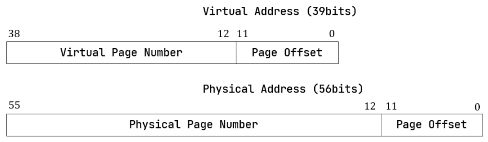

# 内存管理

内存管理作为操作系统的重要功能之一，与操作系统的其他部分联系紧密。内存管理的主要工作是物理内存的分配和回收，而一个好的操作系统还应满足一些非功能需求：

- 尽可能提高内存利用率，减少内存空间的浪费
- 可以为进程提供充足的内存，并且多个进程之间不会争抢内存资源
- 进程与进程、进程与内核之间应互不干扰，以保证安全性

## 一、**基本概念**

### SV39分页机制

RISC-V64架构提供SV39 分页机制，虚拟地址与物理地址格式如下图所示：



其中虚拟地址`[63:39]`未使用，但必须与第38位一致，才能通过MMU的地址检查。因此应用实际可用的虚拟地址只有最低和最高的256GB，而不是$2^{64}B=16EB$

采用三级页表，即将27位的虚拟页号分为三个等长的部分，分别作为三级索引。虚拟地址经过三级页表转换得到物理地址的过程如下图所示：


## 二、**地址空间设计**

采用内核和应用地址空间隔离的设计，对内核建立唯一的内核地址空间存放内核的代码、数据，同时对于每个应用维护一个它们自己的用户地址空间。这就要求内核和进程使用不同的页表，并且在用户态和内核态切换时，通过修改`satp`寄存器完成地址空间的切换。

除了内核和应用地址空间隔离，还有另外一种策略：让每个应用都有一个包含应用和内核的地址空间。我们将在取消手动查页表一节中讨论两种策略的优缺点。

关于地址空间中各部分具体的地址和长度，详见`kernel/src/config.rs`

### 内核地址空间


为了方便处理，内核的四个逻辑段`.text/.rodata/.data/.bass`通过恒等映射的方式建立逻辑地址与物理地址的关联，即逻辑地址==物理地址。

最高的一个虚拟页存放跳板`Trampoline`，是内核与进程、进程与进程（见用户地址空间）之间共享的部分，即对于内核和所有进程，跳板的虚拟地址、物理地址都是一致的。

接下来若干个内核栈和保护页面`Guard Page`。内核栈是操作系统在内核态下，内核代码使用的栈，根据进程创建时由`KSTACK_ALLOCATOR`分配的`kid`标识不同进程的内核栈。保护页面是地址空间中的空洞，换句话说，只存在于虚拟地址空间中，在物理内存中并不存在对应的物理页，因此也无需页表建立映射。由于内核栈向低地址生长，在内核栈空间不足时，会访问到下面的保护页面；而保护页面并未在页面中建立映射，便会触发缺页异常`Page Fault`。通过设置保护页面，可以发现内核栈溢出的情况。

### 用户地址空间


用户地址空间从0开始，保存程序的四个逻辑段`.text/.rodata/.data/.bass`

用户堆`heap`在四个逻辑段之后，向高地址增长。堆的起始地址是`.bss`段结束地址对齐到4KB后的下一个页的地址，结束地址`program break`在进程创建时等于起始地址，即默认堆大小为0。可通过系统调用`sys_brk`设置`program break`的位置，来调整用户堆大小。

内存映射区域`mmap area`在2GB处，默认大小为0，可通过系统调用`sys_mmap/sys_munmap`动态调整内存映射区域大小。

用户栈`stack`设置在4GB处。对于不同的线程，根据线程创建时分配的`tid`标识不同的用户栈。与内核栈类似，同样设置保护页面.

最高页是跳板，与内核地址空间一致。

从次高页开始，依次保存各线程`Trap`上下文。用于进入内核态时保存用户态下的寄存器信息，和退出内核态时恢复用户态下的寄存器信息。

## 三、**内存管理相关syscall实现**

### sys_brk

`sys_brk`的功能是设置`program break`的位置，而`program break`对应用户堆的结束地址，因此需要实现用户堆。可以扩充`MemorySet`成员，增加`heap`字段，同时在`PCB`中记录用户堆起止地址。`sys_brk`调用后，修改用户堆结束地址（`program break`），同时分配或回收对应内存空间即可。

值得一提的是，Linux手册中要求成功调用返回0，而比赛测试脚本中则要求返回`program break`

### sys_mmap

`sys_mmap`用于将文件或设备映射到虚拟地址空间，相当于在内存中设置了一个文件缓存，进程可以通过访问这段内存，达到访问文件的效果。

将上述用户地址空间中`mmap area`作为`sys_mmap`可使用的映射区域，扩充`MemorySet`成员，增加`mmap_area`字段，统一管理已分配的`mmap`区域。结构体定义如下：

```rust
pub struct MemoryMapArea {
    pub vpn_range: VPNRange,
    data_frames: BTreeMap<VirtPageNum, FrameTracker>,
    map_perm: MapPermission,
    fd: usize,
    offset: usize,
    flags: usize,
}
```

当`sys_mmap`调用时，创建一个`MemoryMapArea`，分配内存并通过`fat32`提供的接口读出文件中指定内容，最后将新建的`MemoryMapArea`添加到`mmap_area`中。

### sys_munmap

有了`sys_mmap`建立文件的内存映射，还需要`sys_munmap`取消内存映射。只需要遍历管理`mmap`区域的`mmap_area`字段，找出参数对应的`MemoryMapArea`，将数据写回到文件，最后释放内存。

## 四、**性能优化**

此部分讨论一些可能的性能优化策略，在后续比赛过程中逐步完成。

### **lazy策略**

在第三部分内存管理相关`syscall`实现中，对`heap`和`mmap area`采取的内存分配策略是：起始大小为0，系统调用后立即分配或回收内存空间。但实际上分配出去的空间在大多数程序的运行过程中并未别完全使用、或只是用了很少的一部分。`lazy`策略的核心是：进程第一次请求分配空间时，只是记录下这段地址范围，并不会分配内存；只有当进程访问到这段地址时，操作系统才会在发生缺页中断时分配内存。显然，`lazy`策略能有效避免内存浪费，提高内存利用率。`lazy`策略相关实现在`kernel/src/trap/lazy.rs`

### **copy on write机制**

随着内核开发过程中PCB越来越复杂，`fork`时完全复制地址空间的做法带来的开销越来越大。而且在很多情况下，`fork`完全复制后，子进程可能马上调用`exec`载入新的`ELF`文件，导致`fork`的复制失去了意义。`copy on write`的做法是：在`fork`时子进程不复制地址空间，而是与父进程公用相同的物理页；当其中一方需要执行写操作时，先申请分配一个新的物理页，复制数据。

### 取消手动查页表

考虑一个场景：用户态传入`sys_exec`的第一个参数`path`是一字符串指针，由于内核与应用地址空间隔离，此时处于内核态下无法直接访问到用户态下`path`指向的内容。当前设计中，内核态如果要访问用户态下的数据，需要通过`from_token()`建立临时页表，通过软件的方式手动从地址空间中读出数据。相较于硬件查询，软件的方式会导致效率降低，是否能取消手动查询页表，让硬件完成这一工作？

我们从去年华中科技大学比赛作品中得到启发，如果将用户空间与内核空间合并，让每个应用都有一个包含应用和内核的地址空间，用户态与内核态切换时不会切换页表，内核态下就可以直接访问用户态下的数据。

对比两种设计方式：

内核空间与用户空间隔离的方式在`trap`时需要进行地址空间切换，而在任务切换时无需进行。这种方式能避免用户态下直接访问到内核数据，安全性更高。

内核空间与用户空间合并的方式在`trap`时无需切换地址空间，而在任务切换时需要切换地址空间。当应用程序需要经常进行系统调用时，这种方式能避免频繁切换地址空间带来的开销。但内核的逻辑段需要在每个应用地址空间中都映射一次，可能带来额外的内存占用开销。