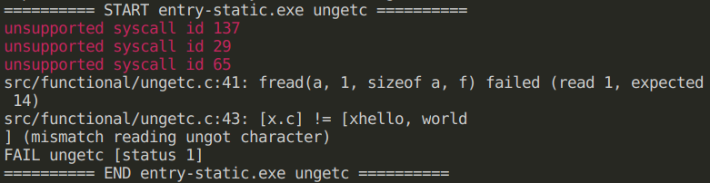
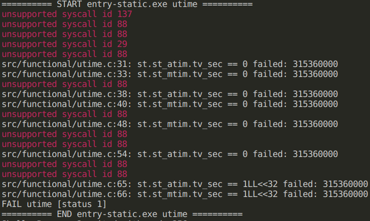

#### 目前进度：83/109

#### 可能缺少的syscall

| id                           | sycall         | 涉及<u>未通过</u>的测例数       |
| ---------------------------- | -------------- | ------------------------------- |
| 226                          | mprotect       | 9                               |
| 29                           | ioctl          | 4（其中3个可能需要其他syscall） |
| 261                          | prlimit64      | 2（可能）                       |
| 43                           | statfs         | 1                               |
| 65                           | readv          | 1                               |
| 67                           | pread64        | 1                               |
| 198、200、204、206、207、208 | （socket相关） | 1                               |
| 25                           | fcntl          | 0                               |
| 98                           | futex          | 0                               |

#### 测试结果

| 序号 | 命令                       | 结果 | 出错信息                                                     | 出错原因 |
| ---- | -------------------------- | ---- | ------------------------------------------------------------ | -------- |
| 1    | argv                       | ✔    |                                                              |          |
| 2    | basename                   | ✔    |                                                              |          |
| 3    | clocale_mbfuncs            | ✔    |                                                              |          |
| 4    | clock_gettime              | ✔    |                                                              |          |
| 5    | crypt                      | ✔    |                                                              |          |
| 6    | dirname                    | ✔    |                                                              |          |
| 7    | env                        | ✔    |                                                              |          |
| 8    | fdopen                     | ✔    |                                                              |          |
| 9    | fnmatch                    | ✔    |                                                              |          |
| 10   | fscanf                     | ❌    | 卡死                                                         |          |
| 11   | fwscanf                    | ❌    | 29未实现                                                     |          |
| 12   | iconv_open                 | ✔    |                                                              |          |
| 13   | inet_pton                  | ✔    |                                                              |          |
| 14   | mbc                        | ✔    |                                                              |          |
| 15   | memstream                  | ✔    |                                                              |          |
| 16   | pthread_cancel_points      | ❌    | 未实现mprotect 226                                           |          |
| 17   | pthread_cancel             | ❌    | 未实现mprotect 226                                           |          |
| 18   | pthread_cond               | ❌    | 未实现mprotect 226                                           |          |
| 19   | pthread_tsd                | ❌    | 未实现mprotect 226                                           |          |
| 20   | qsort                      | ✔    |                                                              |          |
| 21   | random                     | ✔    |                                                              |          |
| 22   | search_hsearch             | ✔    |                                                              |          |
| 23   | search_insque              | ✔    |                                                              |          |
| 24   | search_lsearch             | ✔    |                                                              |          |
| 25   | search_tsearch             | ✔    |                                                              |          |
| 26   | setjmp                     | ❌    |  |          |
| 27   | snprintf                   | ✔    |                                                              |          |
| 28   | socket                     | ❌    | 198、200、204、206、207、208未实现                           |          |
| 29   | sscanf                     | ✔    |                                                              |          |
| 30   | sscanf_long                | ❌    |  |          |
| 31   | stat                       | ❌    |  |          |
| 32   | strftime                   | ✔    |                                                              |          |
| 33   | string                     | ✔    |                                                              |          |
| 34   | string_memcpy              | ✔    |                                                              |          |
| 35   | string_memmem              | ✔    |                                                              |          |
| 36   | string_memset              | ✔    |                                                              |          |
| 37   | string_strchr              | ✔    |                                                              |          |
| 38   | string_strcspn             | ✔    |                                                              |          |
| 39   | string_strstr              | ✔    |                                                              |          |
| 40   | strptime                   | ❌    |  |          |
| 41   | strtod                     | ✔    |                                                              |          |
| 42   | strtod_simple              | ✔    |                                                              |          |
| 43   | strtof                     | ✔    |                                                              |          |
| 44   | strtol                     | ✔    |                                                              |          |
| 45   | strtold                    | ✔    |                                                              |          |
| 46   | swprintf                   | ✔    |                                                              |          |
| 47   | tgmath                     | ✔    |                                                              |          |
| 48   | time                       | ✔    |                                                              |          |
| 49   | tls_align                  | ✔    |                                                              |          |
| 50   | udiv                       | ✔    |                                                              |          |
| 51   | ungetc                     | ❌    | 29、65未实现 |          |
| 52   | utime                      | ❌    | 88、29未实现 |          |
| 53   | wcsstr                     | ✔    |                                                              |          |
| 54   | wcstol                     | ✔    |                                                              |          |
| 55   | pleval                     | ✔    |                                                              |          |
| 56   | daemon_failure             | ❌    | 卡死                                                         |          |
| 57   | dn_expand_empty            | ✔    |                                                              |          |
| 58   | dn_expand_ptr_0            | ✔    |                                                              |          |
| 59   | fflush_exit                | ❌    | 29、67未实现 |          |
| 60   | fgets_eof                  | ✔    |                                                              |          |
| 61   | fgetwc_buffering           | ❌    | 卡死 |          |
| 62   | ~~flockfile_list~~         | ❌    | 已删除                                                       |          |
| 63   | fpclassify_invalid_ld80    | ✔    |                                                              |          |
| 64   | ftello_unflushed_append    | ✔    | 25、29未实现但过了                                           |          |
| 65   | getpwnam_r_crash           | ✔    |                                                              |          |
| 66   | getpwnam_r_errno           | ✔    |                                                              |          |
| 67   | iconv_roundtrips           | ✔    |                                                              |          |
| 68   | inet_ntop_v4mapped         | ✔    |                                                              |          |
| 69   | inet_pton_empty_last_field | ✔    |                                                              |          |
| 70   | iswspace_null              | ✔    |                                                              |          |
| 71   | lrand48_signextend         | ✔    |                                                              |          |
| 72   | lseek_large                | ✔    | 29未实现但过了                                               |          |
| 73   | malloc_0                   | ✔    |                                                              |          |
| 74   | mbsrtowcs_overflow         | ✔    |                                                              |          |
| 75   | memmem_oob_read            | ✔    |                                                              |          |
| 76   | memmem_oob                 | ✔    |                                                              |          |
| 77   | mkdtemp_failure            | ✔    |                                                              |          |
| 78   | mkstemp_failure            | ✔    |                                                              |          |
| 79   | printf_1e9_oob             | ✔    |                                                              |          |
| 80   | printf_fmt_g_round         | ✔    |                                                              |          |
| 81   | printf_fmt_g_zeros         | ✔    |                                                              |          |
| 82   | printf_fmt_n               | ✔    |                                                              |          |
| 83   | pthread_robust_detach      | ❌    | get_robust_list 100未实现                                    |          |
| 84   | pthread_cancel_sem_wait    | ❌    | 未实现mprotect 226                                           |          |
| 85   | pthread_cond_smasher       | ❌    | 未实现mprotect 226                                           |          |
| 86   | pthread_condattr_setclock  | ✔    | 未实现98但过了                                               |          |
| 87   | pthread_exit_cancel        | ❌    | 未实现mprotect 226                                           |          |
| 88   | pthread_once_deadlock      | ❌    | 未实现mprotect 226                                           |          |
| 89   | pthread_rwlock_ebusy       | ❌    | 未实现mprotect 226                                           |          |
| 90   | putenv_doublefree          | ✔    |                                                              |          |
| 91   | regex_backref_0            | ✔    |                                                              |          |
| 92   | regex_bracket_icase        | ✔    |                                                              |          |
| 93   | regex_ere_backref          | ✔    |                                                              |          |
| 94   | regex_escaped_high_byte    | ✔    |                                                              |          |
| 95   | regex_negated_range        | ✔    |                                                              |          |
| 96   | regexec_nosub              | ✔    |                                                              |          |
| 97   | rewind_clear_error         | ✔    |                                                              |          |
| 98   | rlimit_open_files          | ❌    |  |          |
| 99   | scanf_bytes_consumed       | ✔    |                                                              |          |
| 100  | scanf_match_literal_eof    | ✔    |                                                              |          |
| 101  | scanf_nullbyte_char        | ✔    |                                                              |          |
| 102  | setvbuf_unget              | ✔    |                                                              |          |
| 103  | sigprocmask_internal       | ❌    |  |          |
| 104  | sscanf_eof                 | ✔    |                                                              |          |
| 105  | statvfs                    | ❌    | 未实现43 |          |
| 106  | strverscmp                 | ✔    |                                                              |          |
| 107  | syscall_sign_extend        | ❌    |  |          |
| 108  | uselocale_0                | ✔    |                                                              |          |
| 109  | wcsncpy_read_overflow      | ✔    |                                                              |          |
| 110  | wcsstr_false_negative      | ✔    |                                                              |          |

# static

* 220
* 260
* 221
* 96
* 135
* 135
* 134
* 135
* 220
* 135
* 137
* 260
* 178
* 135
* 261
* 221
* 96
* 94

# dynamic

* 220
* 260
* 221
* 96
* 135
* 135
* 134
* 135
* 220
* 135
* 137
* 260
* 178
* 135
* 261
* 221
* 96
* 56
* 25
* 80
* 222