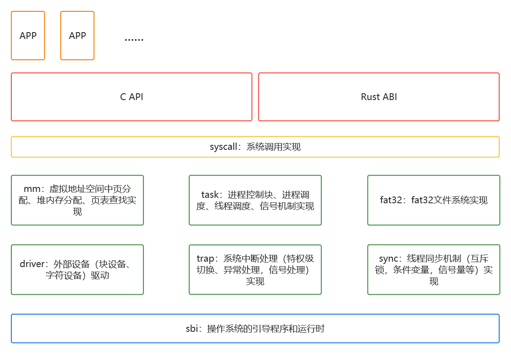
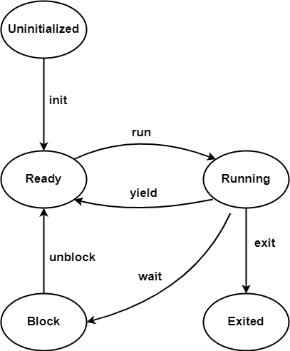
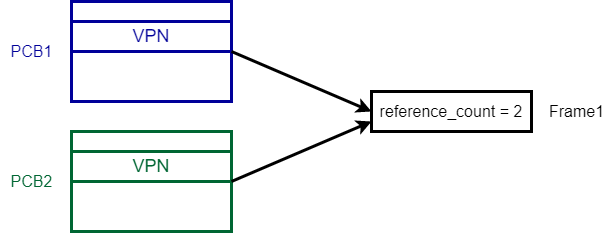
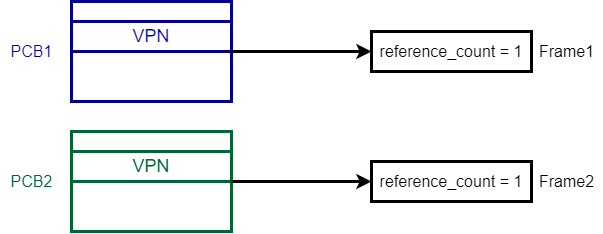
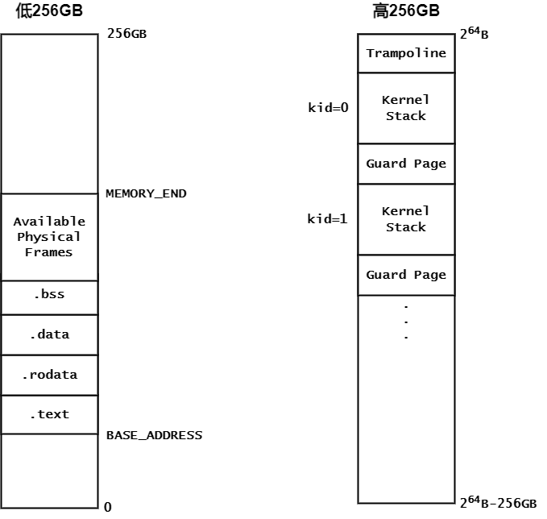
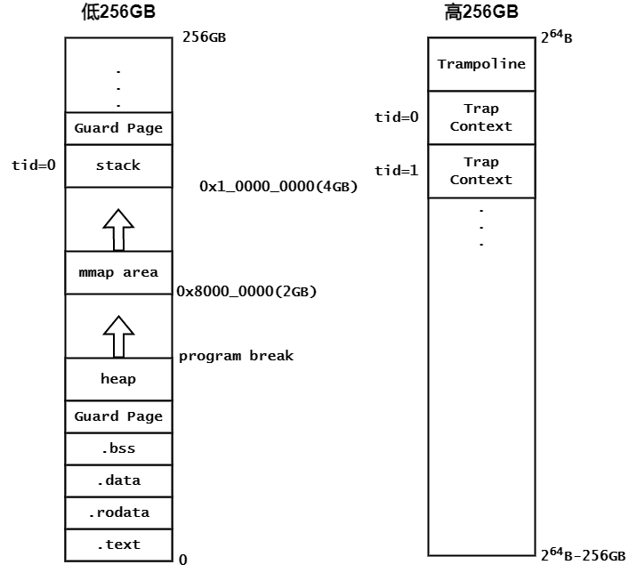
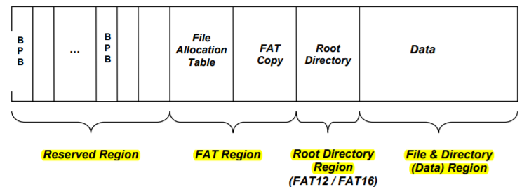
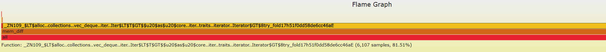

# <center>2022计算机系统能力大赛操作系统设计赛</center>

## <center>untitled-project(1)(1)(4)</center>

### <center>北京科技大学 危南鑫 王浩宇 王博伟</center>

---

# 概述

本系统为用Rust语言编写的，基于RISC-V的操作系统，能够成功运行在QEMU模拟器以及K210平台上。

为了完成此次大赛的功能需求，我们完整实现了系统的基础功能，**总计支持68项系统调用**，能够在K210平台上**成功运行绝大多数lmbench，busybox测例**。

---

<div style="display:flex;justify-content:center;">

</div>
<p style="text-align:center;">系统简要结构图</p>

---

## 测试结果

---

# 进程管理

进程管理主要功能为：实现进程相关数据结构（PCB），实现进程调度相关机制以及实现进程切换相关机制。

当前操作系统中进程状态及其转换图如下：

<div style="display:flex;justify-content:center;">

</div>

我们的操作系统中**引入了线程**的实现，采用的线程调度方式为**时间片轮转 + FIFO**，同时采取了一些优化措施来提高运行效率。

---

## 同步机制

除了普通的互斥锁外，我们还实现了快速用户空间互斥锁（futex）机制。

```rust
pub struct Futex {
    waiters: UPIntrFreeCell<usize>,
    chain: UPIntrFreeCell<VecDeque<Arc<TaskControlBlock>>>,
}
```

利用futex，我们可以在用户态下实现轻量级的IPC，从而避免系统调用和相应的上下文切换开销。

---

## 进程相关优化

### 阻塞进程队列

初赛阶段的wait采取半轮询方式等待子进程终止，即每次被调度后，检查子进程状态，然后让出CPU等待下一次调度。这样导致很多CPU时间浪费在wait上。为了缓解这一情况，我们在进程调度器中引入了`wait_queue`：

```rust
pub struct TaskManager {
    ready_queue: VecDeque<Arc<TaskControlBlock>>,
    block_queue: VecDeque<Arc<TaskControlBlock>>,
}
```

阻塞式wait是在父进程调用wait后，**将父进程挂起到阻塞队列中，此后不会被调度**。只有当wait操作等待的子进程结束后，才将父进程恢复就绪状态。

---

### COW(copy-on-write)策略

进程调用fork生成子进程时，需要为子进程复制一份与父进程相同的地址空间。多数情况下，子进程可能会马上调用exec载入新的ELF文件，原本的地址空间被清除，复制就成了无用功。CoW的做法是，**在创建子进程的过程中，把子进程的虚拟页映射到父进程的物理页上，即父子进程共用同一物理页。当一方执行写操作时，再分配新的物理页，并建立映射关系、复制数据**。
CoW一方面能加快fork执行速度（引用计数比复制数据快），另一方面也能提高内存利用率。

---

<div style="display:flex;flex-direction:column;justify-content:center;">

<p style="text-align:center;">在fork之前，一个虚拟页对应一个物理页</p>
</div>

---

<div style="display:flex;flex-direction:column;justify-content:center;">

<p style="text-align:center;">在fork后，父子进程的地址空间映射到同一个物理页，该页的reference count增加</p>
</div>

---

<div style="display:flex;flex-direction:column;justify-content:center;">

<p style="text-align:center;">如果某个进程对该物理页执行写操作，则触发CoW机制，重新分配页帧并重置reference count</p>
</div>

---

# 内存管理

内存管理的主要功能为：分别实现用户以及内核的内存地址空间布局，实现栈内存、对内存分配、实现页表相关机制，以及实现和文件系统相关联的机制。

<div style="display:flex;flex-direction:row;justify-content:center;gap: 200px;">
<div style="display:flex;justify-content:center;flex-direction:column;">

<p style="text-align:center;">内核地址空间布局</p>
</div>
<div style="display:flex;justify-content:center;flex-direction:column;">

<p style="text-align:center;">用户地址空间布局</p>
</div>
</div>

---

## `mmap`实现

`mmap`相关的系统调用用于将文件或设备映射到虚拟地址空间。


将上述用户地址空间中mmap area作为sys_mmap可使用的映射区域，扩充MemorySet成员，增加mmap_area字段，统一管理已分配的mmap区域。结构体定义如下：

```rust
pub struct MemoryMapArea {
    pub vpn_range: VPNRange,
    pub data_frames: BTreeMap<VirtPageNum, FrameTracker>,
    pub map_perm: MapPermission,
    pub fd: isize,
    pub offset: usize,
    pub flags: usize,
    pub length: usize,
}
```

当`sys_mmap`调用时，创建一个`MemoryMapArea`，分配内存并通过FAT32提供的接口读出文件中指定内容，最后将新建的`MemoryMapArea`添加到`mmap_area`中。

---

## 内存优化策略

### 懒分配的堆/栈/mmap

在比赛之初，为了方便实现，采用静态预分配的方式为每一个用户程序保留固定大小的堆/栈空间，但这会带来两方面问题：

1. 大多数程序对堆/栈/mmap的需求较小，造成内存资源浪费
2. 小部分程序对堆/栈/mmap的需求很高，导致程序无法正常运行

因此就需要一种能动态分配堆/栈空间的方式，基本策略是：只有进程初次使用虚拟页（即引发StorePageFault/LoadPageFault）时，才为其分配和映射内存，即懒分配策略。这种动态分配策略虽然能有效避免内存浪费，但可能带来另外一个问题：引发trap再分配内存会降低程序执行效率。

解决的方式是**结合静态和动态分配策略**，给每个进程提前分配少量堆/栈/mmap空间，满足大部分对堆/栈/mmap需求小的进程，避免这些进程引发懒分配；对于少部分需要大量使用堆/栈/mmap的进程，引发trap后再分配内存。

---

### kmmap

起初exec操作是将ELF文件读入到内核堆中，再解析生成地址空间。内核堆采用伙伴管理系统，需要极大的额外空间以支持大型可执行文件，例如busybox大小为1M，但实际在内核堆中需要2M左右空间。但在实际运行中，并不需要如此大的内核堆，需要将尽可能多的内存留给用户程序。
为此我们参考上一届UltraOS的思路，实现了kmmap，即**为内核服务的mmap**，将文件映射到内存，同时通过非恒等映射为内核提供连续的虚拟地址。

---

# 文件管理

本系统实现了**功能完整的FAT32文件系统**。

<div style="display:flex;justify-content:center;">

</div>
<p style="text-align:center;">FAT卷布局</p>

---

## 文件系统相关优化

### 重构文件系统缓存方式

一开始文件系统使用的是以块为单位的缓存系统，对文件进行读写通过缓存系统代理，查找缓存中是否存在相应的块，如果不存在则将块加载到缓存中，然后再返回相应的块。

但是这种策略在决赛中遇到了几个问题：

1. 因为内存大小有限，只能够给到大约1000个块（500k左右）的缓存空间，然而决赛的可执行文件都有1m左右的大小，做不到对整个文件的缓存，会有大量的换入换出
2. 读取文件时耗费了大量时间在对缓存项进行迭代访问，而且缓存命中率低下

对缓存系统进行重构，**仅保留目录项的缓存，去除以块为单位组织的文件数据缓存**。

---

### 新的文件系统缓存

以文件为单位进行缓存，仅仅缓存当前打开的少量文件中正在读写的数据。缓存在内核关闭文件时写回到磁盘。

在内核中，建立文件inode索引缓存，根据局部性原理，用户程序更有可能访问之前已经打开过的文件，所以将用户打开的文件的inode索引缓存起来，减少对磁盘的的io。

<div style="display:flex;justify-content:center;">

</div>
<p style="text-align:center;">文件系统缓存火焰图</p>

---

### fakefile

针对lmbench中lat_fs测例进行的优化。当用户请求创建一个新的文件时，并不会对文件进行即时创建，而是会创建一个虚假的fakefile作为占位，fakefile中存储了文件的路径，是否可读写以及文件类型等元信息。只有当用户试图对文件进行实际操作时，才会在磁盘中创建对应的文件，并将fakefile替换为实际的inode。

在lat_fs测试中，创建了大量的文件打开并关闭，但是并没有在实际上访问这些文件，所以使用fakefile可以节省大量的用于在磁盘上创建和删除文件的时间。