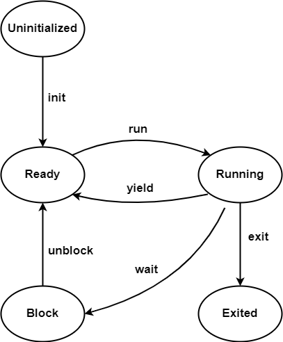

# 进程管理

当前操作系统中进程状态及其转换图如下：



## 进程创建与销毁

操作系统完成基本的初始化工作（初始化内存分配器、启动分页机制、设置时钟中断等）后，自动从SD卡中读入用户初始程序`initproc`并执行，其他进程都直接或间接从`initproc`中`fork`而来。所有进程根据父子关系可以形成树形结构，而`initproc`则是整个进程树的根结点。

进程的创建与销毁依赖于四个系统调用：`sys_fork`、`sys_exec`、`sys_exit`、`sys_wait`。`sys_fork`创建的子进程通过`sys_exec`执行与父进程不同的可执行文件；进程通过`sys_exit`结束执行；父进程通过`sys_wait`等待子进程结束并回收其占用的资源。

### sys_fork

父进程调用`sys_fork`后，内核会复制一个与父进程完全一致的地址空间，作为子进程PCB的一部分。这意味着父子进程在`sys_fork`返回后执行相同的代码。因此在PCB引入`pid`，这样代码中就能通过`sys_fork`的返回值区分父子进程。

实现`sys_fork`的关键在于：如何让进程拥有唯一的`pid`？如何让父子进程`sys_fork`返回不同的值？

对于第一个问题，可以建立一个全局`pid`分配器`PID_ALLOCATOR`。我们采取了一种简单的栈式分配策略，详见`kernel/src/task/id.rs`

对于第二个问题，需要明确一点：RISC-V64指令集将`a0`寄存器（或称为`x10`寄存器）保存系统调用返回值。对于父进程，直接返回子进程pid即可。但对于子进程，需要在处理系统调用时直接修改用户地址空间中的`trap context`，后续在调度时会将其写回到`a0`寄存器中，从而达到修改子进程`sys_fork`返回值的目的。

```rust
pub fn sys_fork() -> isize {
    let current_process = current_process();
    let new_process = current_process.fork();
    let new_pid = new_process.getpid();
    // modify trap context of new_task, because it returns immediately after switching
    let new_process_inner = new_process.inner_exclusive_access();
    let task = new_process_inner.tasks[0].as_ref().unwrap();
    let trap_cx = task.inner_exclusive_access().get_trap_cx();
    // we do not have to move to next instruction since we have done it before
    // for child process, fork returns 0
    trap_cx.x[10] = 0;
    new_pid as isize
}
```

### sys_exec

`sys_fork`只能创建子进程，但子进程仍与父进程执行同样的代码段。通过`sys_exec`可以让进程转而加载并执行一个新的`ELF`文件。具体来说，`sys_exec`需要依次完成以下工作：

1. 根据调用`sys_exec`时传入的`ELF`文件名的字符串指针，通过手动查页表（这是由内核与用户地址空间隔离的设计决定的，详见内存管理相关文档）的方式从用户地址空间中获取到文件名
2. 根据文件名在目录中寻找`ELF`文件
3. 读入并解析`ELF`文件，构造新的用户地址空间，并替换掉旧的地址空间

### sys_exit

`sys_exit`完成的工作比较简单：将自身标记被僵尸进程`Zombie Process`并释放一部分资源，随后主动让出CPU

### sys_wait

当一个进程通过`sys_exit`退出之后，所占用的资源并不会立即释放。这是由于处理`sys_exit`过程中仍需要使用资源。一种处理方式是让父进程通过`sys_wait`回收子进程占用的全部资源。`sys_wait`从当前进程的子进程中寻找僵尸进程，并回收其占用的资源，将子进程的退出码写入到父进程的地址空间中。

## 进程调度

注：由于我们的操作系统引入了线程，本节讨论的内容实际是线程调度。但为了文档的连贯性，此处不严格区分线程和进程。

同一时刻存在于内存中的程序个数往往大于处理器个数，这就要求操作系统应能协调CPU在进程间的分配，提高系统的性能。我们采用的调度方式是时间片轮转+FIFO。时间片轮转依赖于时钟中断，需要在操作系统初始化时设置`sstatus.sie`来开启时钟中断。FIFO调度算法实现具体详见`kernel/src/task/manager.rs`

下面主要分析进程切换的具体流程，以时间片轮转为例：

- 硬件发出时钟中断
- CPU通过`stvec`寄存器找到`__alltraps`的入口地址
- `__alltraps`保存上下文到应用的内核栈
- `kernel/src/trap/mod.rs`的`trap_handler()`处理中断。由于时间片到，操作系统阻塞当前进程，并通过FIFO调度算法选中下一个进程
- `trap_hander`返回后执行`__restore`恢复上下文
- `__restore`通过`sret`指令返回后，跳转到 `sepc`寄存器指向的指令，然后继续执行、